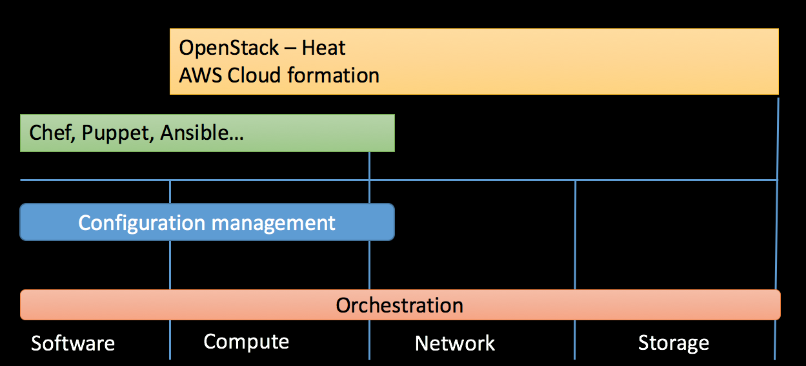

## 2dv517 (former known as 2dv514)
* Deployment Infrastructures (from HT19)
  * The (nearly) same as "Configuration management for DevOps" - 2dv514
  * GitHub organization will be the old name (2dv514)
* Infrastructure as Code (IaC)

--
## Who will have this course?

ME! ME! ME!

ME! ME! ME!
ME! ME! ME!

ME! ME! ME!
ME! ME! ME!

ME! ME! ME!
ME! ME! ME!

ME! ME! ME!
ME! ME! ME!

ME! ME! ME!
ME! ME! ME!

ME! ME! ME!
ME! ME! ME!

ME! ME! ME!
ME! ME! ME!

ME! ME! ME!
ME! ME! ME!

ME! ME! ME!
ME! ME! ME!

ME! ME! ME!
ME! ME! ME!

ME! ME! ME!
ME! ME! ME!

ME! ME! ME!
ME! ME! ME!

ME! ME! ME!
ME! ME! ME!

ME! ME! ME!
ME! ME! ME!

--

## Syllabus
[Link to syllabus](http://kursplan.lnu.se/kursplaner/kursplan-2dv517-1.pdf)
* Main field of study
  * Computer Science (dv)
* Progression
  * G2F
* Prerequisites
  * at least 60 hp Computer Science
  * 1DV032 (and of course 1DV031)

--
<!-- Goals -->
## After the course you should understand
<!-- {_style="font-size: 140%"} -->
* jämföra och utvärdera olika plattformar för serverkonfigurationshantering (1)
* generera automatisk serverkonfigurering (2)
* redogöra för komponenter och designmönser för Infrastructure as Code (3)
* skapa monitorering för övervakning i en driftsmiljö (4)
<!-- {_class="lnu-font-size-80 lnu-margin-right-30"} -->

---
## Approach
* Lectures (mostly pre-recorded), Guest lectures, Peer-instructions
* Examination
  * Report (individual)
    * Do some research about configuration- and provisioning tools
    * Peer-review before final hand-in
  * Practical assignment (group project)
    * Using tools for running Infrastructure as Code.
    * Setting up a infrastructure in CS Cloud
  * Oral hearing 
    * Theoretical part of the course
<!-- {_style="font-size: 90%"} -->

--
## About the group project
* Important to be able to work in teams
* Weekly meeting with customer/coach
* Version-controlled code!!!
  * Git
  * Github project (Kanban-like) assign ticket (labelled and assigned issues)
* How to do an individual examination on a group project?
  * After every week every group member hand-out 20 points
  * Along with the assigned ticket

---
<!-- Literature -->
## Literature
* [Infrastructure as Code: Managing Servers in the Cloud](http://www.adlibris.com/se/organisationer/product.aspx?isbn=1491924357)
  * Kief Morris
  * O'Reilly Media
  * ISBN: 1491924357
* The practice of Cloud System Administration

---
<!-- webpage -->
## Course webpage
[https://coursepress.lnu.se/kurs/configuration-management-for-devops](https://coursepress.lnu.se/kurs/configuration-management-for-devops/)
* Everything static + news
* Slack: Discussions and questions [#2DV514-confman](https://coursepress.slack.com/archives/ 2DV514-confman)
*  2DV514@lnu.se (Private matters only!)
<!-- {_style="margin-right: 25%"} -->

---
## How to start
* Register on course (if you fulfil the requirements)
* Join the slack channel
* Start with the report - Make sure to do a study plan

---
## Definitions

--

#### Some words

* Provisioning (by the book - Morris)
  * "making an infrastructure element"
    * Getting network device/servers ready to use (installed, configured and registered)
* Orchestration
  * Arranging or coordinating multiple systems
  * Provisioning many servers at once
    * Running same task on many servers at once
    * Automate tasks and orchestrate processes
* Configuration Management
  * Practices for handling provisioning and orchestration
    * Configure your server or infrastructure repeatedly, consistently, transparent...
* Infrastructure as Code
  * Applying (agile) software engineering techniques on operations
* Deployment Infrastructures
  * Cloud-based Dynamic Infrastructure platforms for deploying software

--

---
## Dynamic Infrastructure platform

* public/private IaaS, community IaaS...AWS, Azure, Google Cloud, OpenStack
  * Tools for configuration management and provisioning
  * Must be programmable, on-demand, self-service
    * Having programmable interfaces
    * Create and destroy immediately
    * Be able to customize your given resources
* May create servers but is not responsible on what is on them (but could be)
* May pass configuration info to a server configuration tool (network addresses)
* This is a requirement for Infrastructure As Code
(Morris - chapter 2, Should be recap)

--
## Tools requirements

  - Programmable
    - GUI is nice but we want APIs or declarative languages
  - Scriptable & Powerful command-line tools
    * CLI program
    * Take input from other tools (stdin, environment variables, command-line parameters)
    * Output should be able to be used by other tools
  - Support for unattended execution
    * No manual steps in the scripts
    * Triggable scripts, notifications
      * Testable, auto-scaling and recovery routines
  - Externalized configurations
    * Treated as software source code
    * Transparently, consistently, accurate test instances, version control

