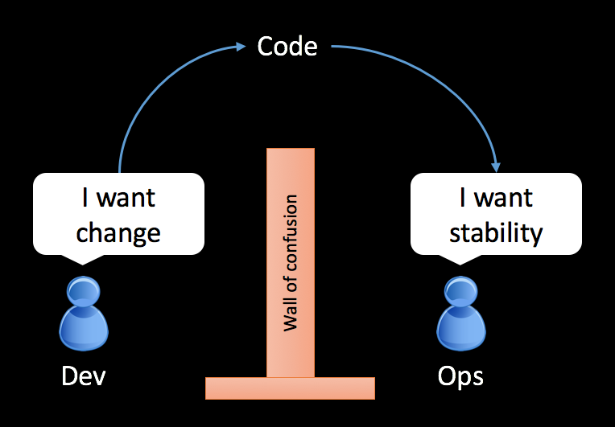
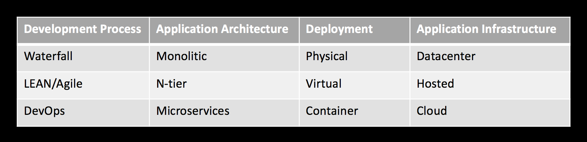
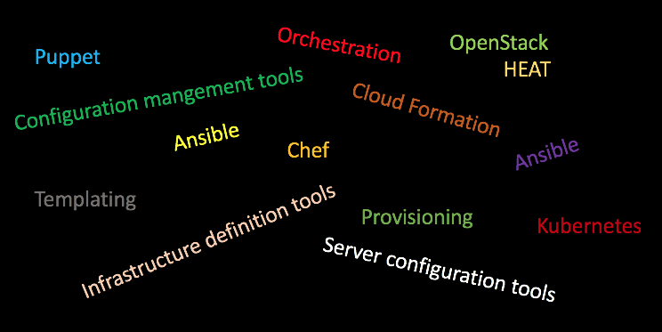
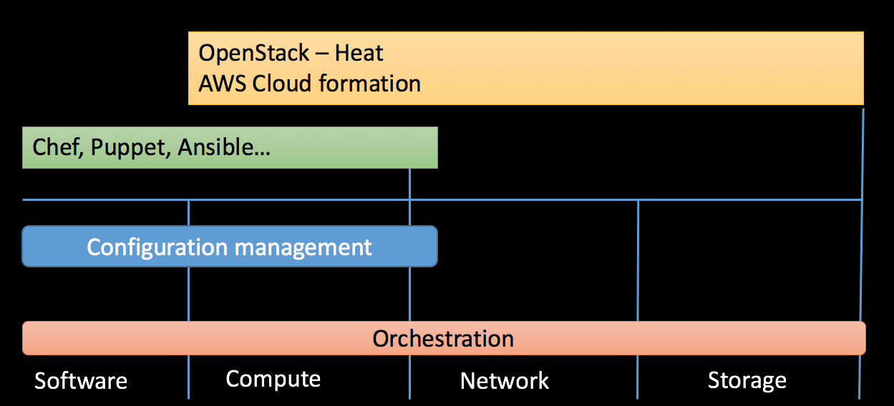

<!-- Content -->
## Content

* DevOps
  * What?
  * Why?
  * You and DevOps...
* Configuration management
  * Wider definition
  * Our focus
  * Infrastructure As Code

---
  ## Conway´s law (1967)
  "Organizations which design systems ... are constrained to produce designs which are copies of the communication structures of these organizations."
   
   

  

---
<!-- DevOps -->
## The problem with delivering software

<!-- {_style="font-size: 140%"} -->
* People
  * Communication, different goals, culture, silos
* Processes
  * Unable to handle changeability, manual workflows, bottlenecks
* Technology
  * Drifting servers, "it worked on my machine", slow delivery
* Bugs, delays and so on...

---
<!-- DevOps -->
## The problem with people

---
<!-- Part 1 -->
## Dev vs. Ops
* Developers (Devs)
  * Rewarded for changeability
* Operations (Ops)
  * Rewarded for stability and uptime
* Management (+ sales, customers, QA, testers...) want both

 

<!-- {_class="fragment"} -->
Some days after our release the web server experience high load...who to blame!?

<ul><!-- {_class="fragment"} -->
  <li>Developers - The code works on my machine!</li>
  <li>Ops - The server is working - The code is the problem!</li>
</ul>

--
DevOps is a reaction!

* Agile-based companies delivering web software
  * Dev - Agile and LEAN Processes
  * Ops - Still waterfall?
  * Web companies assume higher availability, more frequent updates => destabilizing influences
* Devopsday, 2009, Ghent, Belgium
  * "Agile system administrators"
* The need for deep understanding between old silos Dev and Ops
  * Ops using techniques from developers
  * Developers getting greater understanding for operations and deployment - Develop for the production environment
  * Provide both changeability and stability
  * CAMS (https://blog.chef.io/2010/07/16/what-devops-means-to-me)
    * Culture, Automation, Measurement, Sharing

--
## It's about Culture

* Engage early - burst silos!
* Be open
* Don´t blame
* Communications and involvement in every step
* "You built it, you run it!"
  

--
## It's about Automation
* If you can script it - script it!
* Consistence and stability using scripts
* Create fast and automated workflows!
  * Never pass defects, smaller batches are better
* Infrastructure as Code (IaC)
  * Bringing dev techniques into system administration
  * Automated testing

--
## It's about Measurement
* Capture and learn!
* Improve feedback, shorten feedback loops, amplify
* Adjust your understanding based on what you learned
* Measure "everything" - Continuous monitoring

--
## It's about sharing

* Share ideas, experience, metrics through the organization
* "Give the Devs root access" - co-ownership
* Learn from metrics
* "Intern open source"
* Experimentation, allocate time to improve the system/flow

--
## The need to evolve

---
## ...and so on

* DevSecOps
  * "Everyone is responsible for security"
  * Security is a roadblock (waterfall syndrome)
  * http://www.devsecops.org
* The DevOps Role
  * Will I work as a DevOps?
  * Do all companies have a DevOps mindset?

---

## Definitions

--

#### Some words

* Provisioning (by the book - Morris)
  * "making an infrastructure element"
    * Getting network device/servers ready to use (installed, configured and registered)
* Orchestration
  * Arranging or coordinating multiple systems
  * Provisioning many servers at once
    * Running same task on many servers at once
    * Automate tasks and orchestrate processes
* Configuration Management
  * Practices for handling provisioning and orchestration
    * Configure your server or infrastructure repeatedly, consistently, transparent...
* Infrastructure as Code
  * Applying (agile) software engineering techniques on operations
* Deployment Infrastructures
  * Cloud-based Dynamic Infrastructure platforms for deploying software

--

---
## Dynamic Infrastructure platform

* public/private IaaS, community IaaS...AWS, Azure, Google Cloud, OpenStack
  * Tools for configuration management and provisioning
  * Must be programmable, on-demand, self-service
    * Having programmable interfaces
    * Create and destroy immediately
    * Be able to customize your given resources
* May create servers but is not responsible on what is on them (but could be)
* May pass configuration info to a server configuration tool (network addresses)
* This is a requirement for Infrastructure As Code
(Morris - chapter 2, Should be recap)

--
## Tools requirements

  - Programmable
    - GUI is nice but we want APIs or declarative languages
  - Scriptable & Powerful command-line tools
    * CLI program
    * Take input from other tools (stdin, environment variables, command-line parameters)
    * Output should be able to be used by other tools
  - Support for unattended execution
    * No manual steps in the scripts
    * Triggable scripts, notifications
      * Testable, auto-scaling and recovery routines
  - Externalized configurations
    * Treated as software source code
    * Transparently, consistently, accurate test instances, version control

<!-- Configuration management -->
## Configuration management
"Configuration management (CM) is a systems engineering process for establishing and maintaining consistency of a product's performance, functional, and physical attributes with its requirements, design, and operational information throughout its life."

* Manage changes throughout the system lifecycle of complex systems
* ITIL, formally an acronym for Information Technology Infrastructure Library
  *  ITIL volumes as guidance to their IT organizations

--
## Configuration management

* Mange all of the changes that happen whitin your project.
* Records the evolution of your systems and applications
* Handle and govern how your team collaborates

--

So it is about using version control systems?
  

--

## Configuration management and DevOps

* Be able to reproduce any of the environments (operating system, patch level, network configs, software stack and so on)
  * Automation tools, infrastructure as code
* Be able to handle changes (and roll-backs) to the items and deploy to all of my environments
  * Version control
  * Develop vs. testing vs. staging vs. production
* Be able to trace all of your changes
* Manage dependencies, components, software configuration
* Can every team member get the information they need?

--
## Configuration management - Our focus

* Infrastructure as code (IoC)
  * Infrastructure automation based on practices for software development
    * Your infrastructure is treated the same way as your code
    * "Code should be written to describe the desired state of the new machine"
  * Virtualization, cloud, containers, server automation...
  * Defining your environments as code
    * code as documentation, no manual differences (snowflake servers)
* Tools for automation of infrastructure
  * Chef, Ansible, Puppet...

---
## Challenges for IoC

  * Server sprawl
    * It is easy to create new servers, hard to manage to mandatory
  * Configuration Drift
    * Difference can creep in over time
      * Manual "fixing" a specific problem on one servers
      * Updating the application platform on just some servers (not all applications)
      * The configuration settings for same kind of servers differs from different people
      * Someone optimize a specific application server to quickfix a performance issue
  * Snowflake servers
    * A server that can´t be replicated === Fragile infrastructure
  * Automation fear - Kill and rebuild
  * Erosion
    * Things will happen over time (security updates, disk space, restart processes, hardware error)

--
## Principle of IoC
* It should be easy to destroy and rebuild systems/servers
  * The design should support a infrastructure that is always changing
  * "Treat your servers as cattle, not pets"
* System should be consistent
  * Same type of servers should have identical configurations - server templates
* If a task can be scripted, script it!
  * Definition files, consistency, documentation
* Testability
  * Bringing automated testing into Ops

---
## Reading to do

* Read (at least) chapter 1 in Morris book
  *  http://shop.oreilly.com/product/0636920039297.do
* Infrastructure as code - the engine of DevOps
  * https://www.epam.com/about/news-and-events/in-the-news/2015/infrastructure-as-code-the-engine-at-the-heart-of-devops
* 2017 State of DevOps Report
  * https://puppet.com/resources/whitepaper/state-of-devops-report

---

# Bye for now!

