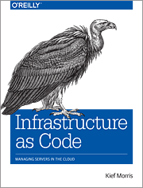

## Confusion

### All these words...
<!-- {_class="fragment"} -->

--

#### Some definitions

* Provisioning (by the book - Morris)
  * "making an infrastructure element"
    * Getting network device/servers ready to use (installed, configured and registered)
* Orchestration<!-- {_class="fragment"} -->
  * Arranging or coordinating multiple systems
  * Provisioning many servers at once
    * Running same task on many servers at once
    * Automate tasks and orchestrate processes
* Configuration Management<!-- {_class="fragment"} -->
  * Practices for handling provisioning and orchestration
    * Configure your server or infrastructure repeatedly, consistently, transparent...
* Infrastructure as Code<!-- {_class="fragment"} -->
  * Applying (agile) software engineering techniques on Configuration Management
* Deployment Infrastructures<!-- {_class="fragment"} -->
  * Cloud-based Dynamic Infrastructure platforms for deploying software

---
## Dynamic Infrastructure platform

* public/private IaaS, community IaaS...AWS, Azure, Google Cloud, OpenStack<!-- {_class="fragment"} -->
  * Have own or support tools for configuration management and provisioning
  * Must be programmable, on-demand, self-service<!-- {_class="fragment"} -->
    * Having programmable interfaces
    * Create and destroy immediately
    * Be able to customize your given resources
* This is a requirement for Infrastructure As Code<!-- {_class="fragment"} -->
  * (Morris - chapter 2, Should be recap)

--
<!-- Configuration management -->
## Configuration management

"Configuration management (CM) is a systems engineering process for establishing and maintaining consistency of a product's performance, functional, and physical attributes with its requirements, design, and operational information throughout its life."<!-- {_class="fragment"} -->

* Manage changes throughout the system lifecycle of complex systems<!-- {_class="fragment"} -->
* ITIL, formally an acronym for Information Technology Infrastructure Library<!-- {_class="fragment"} -->
  * ITIL volumes as guidance to IT organizations for delivering high quality it-services
  * https://en.wikipedia.org/wiki/Configuration_Management_(ITSM)

--
## Configuration management

* Mange all of the changes that happen within your project.
* Records the evolution of your systems and applications
* Handle and govern how your team collaborates

So it is about using version control systems?

<!-- {_class="fragment"} -->

--
#### Configuration management and DevOps

* Be able to reproduce any of the environments (operating system, patch level, network configs, software stack and so on)<!-- {_class="fragment"} -->
  * Automation tools, infrastructure as code
* Be able to handle changes (and roll-backs) to the items and deploy to all of my environments<!-- {_class="fragment"} -->
  * Manage dependencies, components, software configuration
  * Develop vs. testing vs. staging vs. production
* Can every team member get the information they need?<!-- {_class="fragment"} -->

--
## Our focus

* Infrastructure as code (IoC)
  * Infrastructure automation based on practices for software development
    * Your infrastructure is treated the same way as your code
    * "Code should be written to describe the desired state of the new machine"
  * Virtualization, cloud, containers, server automation...
  * Defining your environments as code
    * code as documentation, avoid manual failures
* Tools for automation of infrastructure
  * Chef, Ansible, Puppet, Terraform...

---
## Challenges for IoC to solve
* Configuration Drift <!-- {_class="fragment"} -->
  * Difference can creep in over time
    * Manual "fixing" a specific problem on one servers
    * Updating the application platform on just some servers (not all applications)
    * The configuration settings for same kind of servers differs from different people
    * Someone optimize a specific application server to quickfix a performance issue
* Erosion <!-- {_class="fragment"} -->
  * Things will happen over time (security updates, disk space, restart processes, hardware error)
* Snowflake servers <!-- {_class="fragment"} -->
  * A server that can´t be replicated === Fragile infrastructure
* Server sprawl <!-- {_class="fragment"} -->
  * It is easy to create new servers, hard to manage to mandatory
* Automation fear - Kill and rebuild <!-- {_class="fragment"} -->

--
## Principle of IoC
* It should be easy to destroy and rebuild systems/servers 
  * The design should support a infrastructure that is always changing
  * "Treat your servers as cattle, not pets"
* System should be consistent <!-- {_class="fragment"} -->
  * Same type of servers should have identical configurations - server templates
  * Servers of same kind should have same state
* If a task can be scripted, script it! <!-- {_class="fragment"} -->
  * Definition files, consistency, documentation
* Testability <!-- {_class="fragment"} -->
  * Bringing automated testing into Ops

---
## Reading to do

* Read chapter 1-2 in Morris book
  *  http://shop.oreilly.com/product/0636920039297.do
* Infrastructure as code - the engine of DevOps
  * https://www.epam.com/about/news-and-events/in-the-news/2015/infrastructure-as-code-the-engine-at-the-heart-of-devops

---

# Bye for now!

