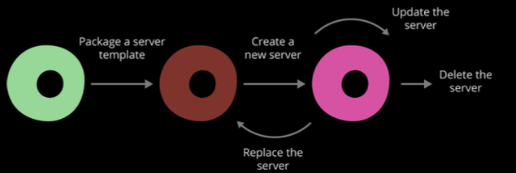
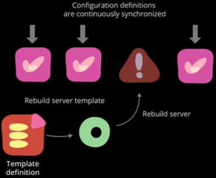
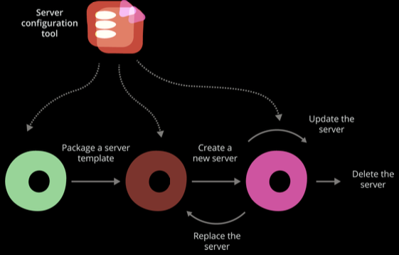
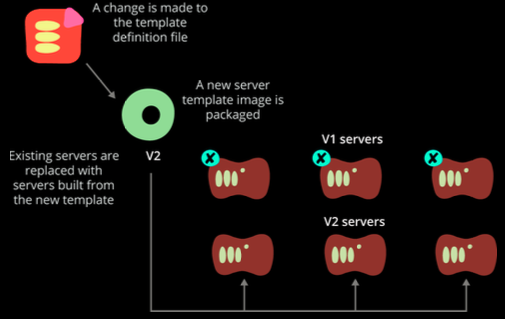
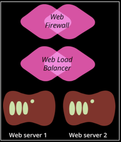
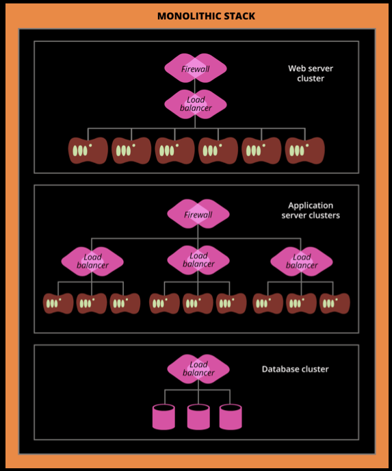
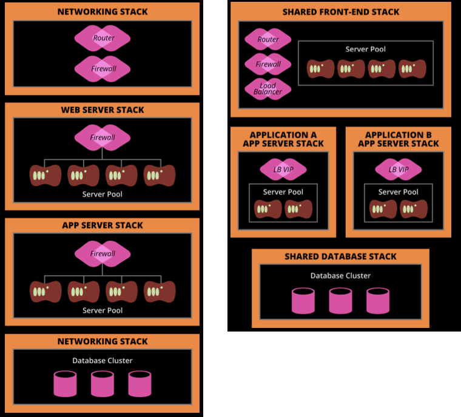

# Patterns for...
* provisioning servers
* server templates
* managing server changes and updates
* defining infrastructure


---
## Patterns for provisioning servers
### Provisioning
* "making an infrastructure element ready to use"
* server example
  * assigning resources
  * installation
  * configuration
  * registration
  
Note:
assigning resources - Name, ip, physical, virtual <br/>
installation - <br/>
configuration - <br/>
registration - infrastructure services, monitoring and DNS


--
## Patterns for provisioning servers
### Characteristics of an effective provisioning process
* Infrastructure elements can be rebuilt on demand
* Define elements once -> roll out to multiple
* Transparent and easily modified

Note:
* Any **existing infrastructure element** can be effortlessly **rebuilt on demand**.<br/>
* A **new element can be defined once**, and then rolled out and replicated to multiple instances and environments.<br/>
* The **definition of any element**, and the process to provision it, is **transparent and easily modified**.


--
## Server´s lifecycle


* Package a server template
* Create a new server
* Update a server
* Replace a server
* Delete a server

Source: Infrastructure as Code

<!-- {_style="text-align: right; font-size:60%"} -->

Note:
*Package a server template* - Creating an Image, **Amazon AMI or VMWare Templates** or use a **Snapshot**. Usually **starts with an OS ISO** <br />
*Create a new server* - **Provisioning** <br />
*Update a server* - Problem: **consistency doesn’t last**, template are **continuously updated** cause servers to **diverge** <br />
*Replace a server* - Some changes may **require completely replacing** a server, major new version of an OS. May be **easier to completely rebuild** a server rather than change it. <br />
*Delete a server* -  **infrastructure services** need to be updated, **data** may also need to be retained, retaining historical **metrics and log data** for debugging<br />
*Other events in a server’s life* - Recover from failure, Resize a server pool, Reconfigure hardware resources


--
## Whats on a server?
* Software
* Configuration
* Data

How does configuration management treats this?

Note:
*Software* - Applications, libraries, files that are static and don’t tend to vary from one system to another. <br />
*Configuration* - Files used to control how the system and/or applications work. <br />
*Data* - Files generated and updated by the system, applications, and so on.  <br />
 <br />
*Software* - Makes sure it’s the same on every relevant server; doesn’t care what’s inside <br />
*Configuration* - Makes sure it has the right contents on every relevant server; will make sure it’s consistent and correct. <br />
*Data* - Naturally occurring and changing; may need to preserve it, but won’t try to manage what’s inside. <br />


--
## Where does it all come from?
* Base operating system
* System package repositories
* Language, framework, and other platform repositories
* Third-party packages
* In-house software packages

Why should we care?

Note:
Internal repository <br />
Consistency, security,


--
## Server Roles
* What is the purpose of the server?
* Puppet calls is "classes"

Patterns for server roles
* fine-grained roles
* role-inheritance hierarchy


--
## Patterns for creating servers
* By hand - Antipattern
```bash
openstack server create --flavor m1.medium --image "fedora-21-atomic"                 -
   --key-name MyServer-pubkey  --security-group default  MyServer-test
```
* Use a script
* Hot Clone - Antipattern
* Server Template
* Snowflake factory - Antipattern


--
## Smoke Test new servers
* Automatically created servers should be automatically tested
* Based on the server role:
  * server running and accessible
  * monitoring agent
  * DNS
  * ports
  * firewall
  * accounts
* should be used in CI and CD


---
## Patterns for server templates
* A starting point for a new server
* Build new servers consistently and repeatably
* Process of building a server template should be:
  * repeatable
  * transparent
  * self-documenting
  * self-testing
* Stock Template or do it yourself?


--
## Building a server template
1. Selecting an origin image
2. Applying customizations to the image
3. Packaging the image into a server template image


--
## Selecting an origin image
* Hot Cloned Server Template - Antipattern
* OS installation image
* Stock image


--
## Applying customizations to the image
Ways to apply customization
* Boot the origin images and apply changes
* Mount origin image and apply changes

What should be included?
* Provisioning at Creation Time
* Provisioning in the Template
* Mixed


--
### Packaging the image into a server template
Time to bake it into a server template
* saved into a format recognized by your infrastructure:
  * Openstack image
  * AWS AMI
  * VMWare server template
* multiple platforms


--
## Maintaining a Server Template
* Reheating a template
* Baking a fresh template
* Versioning
* Traceability
* Removing templates


---
## Patterns for
### managing server changes and updates
* Easy to create new servers, but keeping them up to date is hard.
* Often leeds to inconsistent servers and server drift
* Process for managing server changes:
  * ensures that all new changes are applied to both existing and new server
  * all server should be up to date with:
    * latest approved packages
    * patches
    * configuration


--
## Managing server changes
Characteristics of an effective server change process:
* automated process
* effects all relevant servers
* similar servers are not allowed to drift into inconsistency
* unattended process
* effort involved in a change is the same
* errors are made visible quickly.

Note:
The automated process is the easiest, most natural way for team members to make changes. <br />
Changes are rolled out to all of the relevant existing servers. <br />
Servers that are meant to be similar are not allowed to drift into inconsistency. <br />
Changes are applied as an unattended process. <br />
The effort involved in a change is the same, regardless of how many servers are affected by it. <br />
Errors changes are made visible quickly. <br />


--
## Server Change Management Models
* Ad Hoc Change Management
* Continuous Configuration Synchronization
* Immutable Servers
* Containerized Servers


--
## General Patterns and Practices


<!-- {_style="float: right"} -->

* minimize server templates
* replace servers when the server template change
* Phoenix servers
<br /><br /><br /><br /><br />


Source: Infrastructure as Code

<!-- {_style="text-align: right; font-size:60%"} -->


--
## Continuous Configuration
* push or pull to synchronize
* materless configuration management 
* server configuration tool to continuously synchronize configuration 


Source: Infrastructure as Code

<!-- {_style="text-align: right; font-size:60%"} -->


--
## Immutable Servers
* server image as artifact
* simplifies confirmation management tooling
* immutable server flow



Source: Infrastructure as Code

<!-- {_style="text-align: right; font-size:60%"} -->


---
## Patterns for defining infrastructure
* provision and configure larger groups of infrastructure elements
* group in to a **Stack**
  * collection of infrastructure elements that are defined as a unit
  * can be any size
    * a single server
    * a pool of servers
    * an entire data center
  * defined and changed as a unit
* environments
  * development
  * test
  * preproduction
  * production


--
## Infrastructure Stacks as Code


<!-- {_style="float: right; padding-left: 200px"} -->
```nginx
resource "aws_instance" "web_server_1" { 
  ami = "ami-47a23a30"
  instance_type = "t2.micro"
}
resource "aws_instance" "web_server_2" { 
  ami = "ami-47a23a30"
  instance_type = "t2.micro"
}
resource "aws_elb" "web_load_balancer" {
  name = "weblb"
  listener {
    instance_port = 80
    instance_protocol = "http"
    lb_port = 80
    lb_protocol = "http"
  }
  instances = [
      "${aws_instance.web_server_1.id}",
      "${aws_instance.web_server_2.id}"
    ]
  security_groups = ["${aws_security_group.web_firewall.id}"]
}
resource "aws_security_group" "web_firewall" {
  name = "web_firewall"
  ingress {
    from_port = 80
    to_port = 80
    protocol = "tcp"
    cidr_blocks = ["0.0.0.0/0"]
  }
}
```
<!-- {_style="font-size:25%"} -->

* Webserver cluster with frontend networking
* Terraform for AWS

Source: Infrastructure as Code
<!-- {_style="text-align: right; font-size:60%"} -->


--
## Infrastructure Stacks as Code
```nginx
variable "environment" {}
resource "aws_instance" "web_server_1" { 
  ami = "ami-47a23a30"
  instance_type = "t2.micro"
  tags {
    Name = "Web Server 1"
    Environment = "${var.environment}"
  }
}
resource "aws_instance" "web_server_2" { 
  ami = "ami-47a23a30"
  instance_type = "t2.micro"
  tags {
    Name = "Web Server 2"
    Environment = "${var.environment}"
  }
}
```
<!-- {_style="font-size:40%; float: right; width: 40%"} -->
* Per-Environment Definition Files - Antipattern
* Reusable Definition Files
  * First for QA:
```bash
$ terraform apply -state=qa-env.tfstate -var environment=qa
```
<!-- {_style="font-size:50%"} -->
  * Then the tool is run again for PROD:
```bash
$ terraform apply -state=prod-env.tfstate -var environment=prod
```
<!-- {_style="font-size:50%"} -->


--
## Organizing Infrastructure



<!-- {_style="width:38%; float: right;"} -->
Monolithic Stack - Antipattern
* easy for a small change to break many things
* hard to avoid tight coupling between the parts of the infrastructure
* each instance of the environment is large and expensive
* changes requires testing an entire stack at once
* difficult to delegate and divide responsibilities 

<!-- {_style="font-size:65%"} -->


--
## Organizing Infrastructure

* dividing into Multiple Stacks
  * each tier to be changed independently
  * stacks have interdependencies
* sharing infrastructure elements
  * cost effective
  * less flexible




<!-- {_style="width:50%; float: right;"} -->
