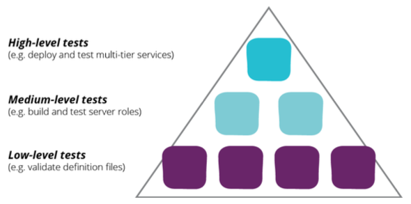
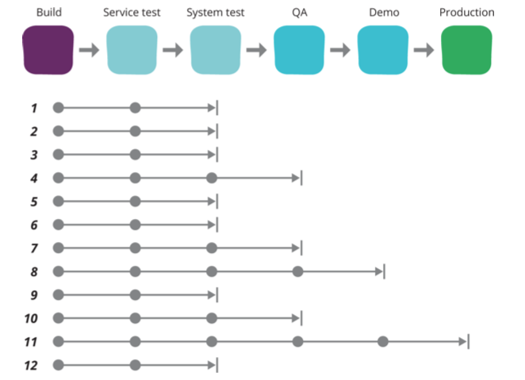
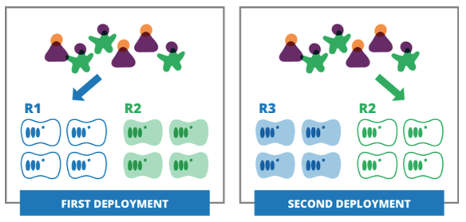
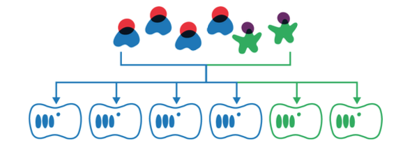

# Contents

* Software Engineering Practices for infrastructure
* Testing the infrastructure
* Change Management pipeline (very shortly)
* Availability
* When things go wrong

---
## Software Engineering Practices for infrastructure
* Quality in software engineering and quality in infrastructure
  * proven tools and technics can be used to build quality in the system
* Start delivering working, useful code fast
* Continuous delivering necessary and simple increments
* Ensure that each change is well tested
* Get fast feedback on every change
* Expect that the system and its requirements will change

--
## What is system quality

> The true measure of the quality of a system, and its code, is how quickly and safely changes are made to it

* The tools (or language or framework) doesn´t make the quality any better by it self
* easy to understand, simple to change, fast feedback from problems.

Note:
Code that are difficult to understand is difficult to change 
New to team should understand - first day, code into production 
Minimal documentation

--
## VCS for infrastructure

* Everything but artifacts that can be build from the code already in the repository, data, log files, passwords, security secrets.
* Apply to Continuous Integration
  * Merge code as fast as possible to detect problems (with tests)
  * Avoid "merge debts"
* Branching
  * Feature Branching
    * When a person or a group works on a isolated feature. Merging when ready!
  * Release Branching
    * When new releases are put into production a branch is created to reflect the current version (to fix bugs, security). The new release is the master trunc
  * Continuous Integration
    * All work is committed to the trunc, fully tested and working in production.
    * When error/fail, fix the problem (or revert) before anyone else commits.

Note: uncomet tests, timepressure...

--
## CI and CD for infrastructure

* Continuous testing changes made to definition files, scripts and other configuration files written for the infrastructure.
  * Managed by the VCS
* Make sure everything "always" is production ready
* Testing the whole infrastructure - Must be tested
* Changes pipeline for infrastructure
  * Increases level of complexity from when just talking applications
  * Test environment should be the same (looked down) as production

--
## Managing major infrastructure features
* Delivering complex systems in an agile way
  * Break down into smaller changes
  * Each change should be useful and visible
  * Slowly replaces old system
* Keep changes hidden from users
  * Parallel systems, old and new
  * Test specific services not to critical
    * Feature hiding - Deploy but don´t let users or system use the features
    * Feature toggles - Implement configuration setting to toggle feature on and off
    * Branch by abstraction - Deploy but use old in production, new in test environment

---
## Testing your infrastructure

* Agile approach to testing, TDD
* Automated testing for fast feedback
* Test pyramid
  * Many, fast running low level test, syntax validation, unit tests
  * Medium-level test, build and test server instances
  * High-level tests, deploy and test multi-tier services

Source: Infrastructure as Code

<!-- {_style="text-align: right; font-size:60%"} -->

--
## Low-level testing

  * Syntax checking
    * checking syntax of a Ansible playbook
  * Static code analysis
    * Linting, ex [ansible-lint](https://github.com/willthames/ansible-lint)
    * "coding hygiene"
    * Unit testing, ex. ChefSpec
    * running configuration definitions to be run without actually applying (emulate)

--
## Middle-level testing
* Building templates, create instance and validate it is running by running some tests
* Should not test individual components. Making servers ready to integrate
* The resources (servers, networking ect) should be disposed after each test
  * Rebuild from scratch before every test
* Local virtualized test
  * Vagrant - catching problem fast
* [kitchen.ci](http://kitchen.ci/)
  * Plugins for Puppet, Chef and Ansible

--
## High-level testing
* Testing multiple elements of infrastructure so that they work when integrated
* Testing integrating external systems
* Should using the same structure and tooling as in production
* Slowest testing - keep it effective
* [ServerSpec](http://serverspec.org/)

--
## Testing operational Quality
* Performance, availability, security...
  * Defining targets and thresholds
  * Performance tests
  * Scanning for common programming errors
  * Scanning for known security errors (Common vulnerabilities and Exposures system - CVE)
* Could take place at all layers but is most important at the high-level

--
## Configuration management tools and testing

* Ansible

--
## Change Management pipelines for infrastructure

* Chapter 12 & 13 - Save the most for next course
* Continuous changes
  * Continuous Integration (CI), Continuous Delivery (CD)
* Each change should be tested and production ready
* Applying changes to production should be at low risk and impact
* All changes should go trough the pipelines
  * Should be the easiest way to do changes (no manual hacking)
  * Transparent to reviewers

--
## Pipeline

<!-- {_class="center"} -->

Source: Infrastructure as Code
<!-- {_style="text-align: right; font-size:60%"} -->

Note: Some stages are manual!

--
## Continuously availability
* How to handle change without taking the service down?
  * If something go wrong - fast detection and recovery
* Traditional - Avoid changes!

--
## Service Continuity
* How to handle changes/errors without the end-user notice?
* Uptime
  * 99.999% uptime ("unplanned outages")
* Dynamic server pool
  * Running health checks, replaces failed servers
  * Could mask real problems
  * Could affect software designed (some architectures assumption static infrastructure)
    * Stateful sessions, local data storing, static configuration
    * Cloud-native software (page 279 - Morris)- [12-factor applications](https://12factor.net/)

---
## Patterns for Zero-Downtime
* Blue-Green replacement
* Phoenix replacement
* Canary replacement
* Impractical on bigger infrastructures
  * Sub-sections, loosely coupled services

--
## Blue-Green replacement

* Two instances - One for testing, one for production
* Switching, fail back to the old if problem
* Intelligent routing

Source: Infrastructure as Code

<!-- {_style="text-align: right; font-size:60%"} -->

--
## Phoenix Replacement
* A new instance is created when a change is made
  * Don´t need two parallel running instances
* Create the new, testing, switch to it
  * Keeping the old one until the new proven in use.
* Phoenix server pattern and immutable infrastructure

--
## Canary replacement
* Used by larger organizations (Google, facebook...)
* Deploying the new version of an element alongside the old one, and then routing some portion of usage to the new elements.

Source: Infrastructure as Code

<!-- {_style="text-align: right; font-size:60%"} -->

---
## Data Continuity
* How to handle our data - if the components use read/write data storage, this can be a challenge.
* Replicating data redundantly
  * ensure it is replicated across multiple instances, with redundancy
  * Could be recovered if a node is lost (what if many lost nodes?)
* Regenerating data
  * Getting data from other systems - load into runtime
* Delegating data persistence
  * put the data on a dedicated service
* Backing up to persistent storage
  * Be sure to understand where your data is - Confusion in the cloud
  * Make sure your backups are routinely retrieved and used - use it in your test environment?

--
## When things goes bad - Disaster recovery
* DR-plan, what to do when a service is failing
  * What do we need, how much time will it take. Thinking of all stuff going wrong (losing your VCS?)
* Servers and services will disappear (scaling up and down)
  * should be a trivial event - rebuilding servers will happen every day
  * Building environments should also be routine (if larger-scale failures)
* People must know when something goes wrong (monitoring) - triggers recovery

--
* Can your system handle the full load a big failure will cause
  * provisioning servers and so on...
* How does the element works if their peers are disconnected
  * Chaos Monkey - Semi-randomly destroys server instances
  * Chaos Gorilla - Removes whole data centers
  * Latency Monkeys - Artificial delays to see weather services handles degradation correctly

--
## Read the book

* Chapter 10, 11, 14
* Chapter 12, 13, 15 (briefly)

---
# Tack för idag!

<!-- {_class="center"} -->
