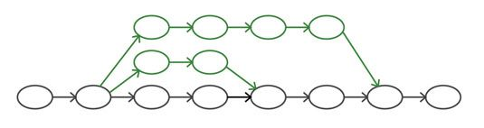

### Contents
* Software Engineering Practices for operating infrastructure
  * System quality
  * VCS for infrastructure
    * Branching
    * Continuous availability
* Testing the infrastructure
  * Test pyramid

---
#### What is system quality?

> The true measure of the quality of a system,  
and its code,  
is how quickly and safely changes are made to it

* The tools (or language or framework) doesn't make the quality any better by it self<!-- {_class="fragment"} -->
  * Easy to understand, simple to change, fast feedback from problems.
  * Code that are difficult to understand is difficult to change
  * New to team should understand - first day, code into production
* Minimal required documentation<!-- {_class="fragment"} -->

--
#### Software Engineering Practices for infrastructure
* Use proven tools and strategies to build quality into the process<!-- {_class="fragment"} -->
* Expect that the system and its requirements will change<!-- {_class="fragment"} -->
* Start delivering working, useful code fast<!-- {_class="fragment"} -->
  * Continuous delivering necessary and simple increments
* Ensure that each change is well tested<!-- {_class="fragment"} -->
  * Get fast feedback on every change
* ...Agile manifesto...<!-- {_class="fragment"} -->

--
#### CI and CD for infrastructure

* Continuous testing changes made to definition files, scripts and other configuration files written for the infrastructure.
  * Managed by the VCS
  * Make sure everything "always" is production ready
* Testing the whole infrastructure<!-- {_class="fragment"} -->
  * Change pipeline for infrastructure
  * Increases level of complexity from when just talking applications
  * Test environment should be the same (looked down) as production

--
#### VCS for infrastructure

* Everything but artefacts that can be build from the code already in the VCS repository
  * data, log files, passwords, security secrets.
* VCS not only for version control - Work processes in the team<!-- {_class="fragment"} -->
  * Many team members - how to check in code
  * Coordinate changes
* Branching & merging<!-- {_class="fragment"} -->
  * Make a branch to keep work isolated
  * Lots of different branch patterns
    * Feature branching, Environment branches
  * Never have long-lived branches
* Continuous Integration<!-- {_class="fragment"} -->
  * All work is committed to the trunc/master/deployment branch, fully tested and working in production.
  * Merge code as fast as possible to detect problems fast (with tests)

--
### Branching strategies

* Feature branching
  * Every new feature, fix or change to code is pushed to a new branch
  * When done, merge to "master", handle conflicts directly!
    * or use a pull request so some could review the changes
  * Keep branches short-lived

[Article about feature branching from Atlassian](https://www.atlassian.com/git/tutorials/comparing-workflows/feature-branch-workflow) 
[From "http://csci221.artifice.cc/lecture/collaboration-with-git.html"](http://csci221.artifice.cc/lecture/collaboration-with-git.html)

<!-- {_class="fragment"} -->

---
#### Continuously availability
* How to handle change without taking the service down?
  * If something go wrong - fast detection and recovery
* Traditional solution - Avoid changes!<!-- {_class="fragment"} -->
  * Notify customers about downtime

--
#### Manage major infrastructure changes
* Delivering complex systems in an agile way
  * Break down into smaller changes (can´t always be done)
* Parallel systems, old and new<!-- {_class="fragment"} -->
  * Slowly replaces old system  
  * Start with "non-critical services"  
  * Select "candidate-service"

--
#### Patterns for Zero-Downtime
* Blue-Green replacement
* Phoenix replacement
  * Impractical on bigger infrastructures
    * Sub-sections, loosely coupled services
* Canary replacement

--
#### Blue-Green replacement

* Two instances/environments - One for testing, one for production
* Switching, fail back to the old if problem
* If proven, hold the old to prepare next change
* Intelligent routing
* Need two sets of infrastructure!

--
#### Phoenix Replacement
* A new instance of infrastructure is created when a change is made
  * Don´t need two parallel running instances all the time
* Create the new, testing, switch to it
  * Keeping the old one until the new proven in use.
* Basis for immutable infrastructure

--
#### Canary replacement
* Used by larger organizations (Google, Facebook...)
* Deploying the new version of an element alongside the old one, and then routing some portion of usage to the new elements.
* More effective use of resources

---
#### Testing your infrastructure

* Agile approach to testing, TDD, Automated testing for fast feedback
  * https://docs.ansible.com/ansible/latest/reference_appendices/test_strategies.html
* Test pyramid<!-- {_class="fragment"} -->
  * Many, fast running low level test
  * Medium-level test, build and test server instances
  * High-level tests, deploy and test multi-tier services

 <!-- {_class="fragment"} -->

--
#### Low-level testing

  * Syntax checking
    * checking syntax of a Ansible playbook
  * Static code analysis <!-- {_class="fragment"} -->
    * Linting, ex [ansible-lint](https://github.com/willthames/ansible-lint)
    * "coding hygiene", Simple, readable, Code standard
    * Unit testing, ex. ChefSpec
    * Run test that don´t have long build process

--
#### Middle-level testing
* Building templates, create instance and validate it is running by running some tests
  * OS-level checks
* Testing that servers are ready to integrate (smoke test) <!-- {_class="fragment"} -->
* The resources (servers, networking ect) should be disposed after each test  <!-- {_class="fragment"} -->
  * Rebuild from scratch before every test
* Local virtualized test <!-- {_class="fragment"} -->
  * Vagrant - catching problem fast

--
#### High-level testing
* Testing multiple elements of infrastructure so that they work when integrated
* Testing integrating external systems <!-- {_class="fragment"} -->
* Should using the same structure and tooling as in production <!-- {_class="fragment"} -->
* Slowest testing - keep it effective <!-- {_class="fragment"} -->
* [ServerSpec](http://serverspec.org/) <!-- {_class="fragment"} -->

--
#### Testing operational quality
* Performance, availability, security...
  * Defining targets and thresholds
  * Performance tests
    * [ab - Apache HTTP server benchmarking tool](https://httpd.apache.org/docs/2.4/programs/ab.html)
  * Scanning for common programming errors
  * Scanning for known security errors (Common vulnerabilities and Exposures system - CVE)
    * https://cve.mitre.org/cve/cve.html
* **Monitoring**

---
#### When things goes bad - Disaster recovery
* DR-plan, what to do when a service is failing
  * What do we need, how much time will it take. Thinking of all stuff going wrong (losing your VCS?)
  * Expect that things will go wrong...
* Servers and services will disappear (scaling up and down)<!-- {_class="fragment"} -->
  * should be a trivial event - rebuilding servers will happen every day
  * Building environments should also be routine (if larger-scale failures)
* People must know when something goes wrong (monitoring) - triggers recovery<!-- {_class="fragment"} -->

--
* Can your system handle the full load a big failure will cause
  * The Netflix Simian Army 
  * Chaos Monkey - Semi-randomly destroys server instances<!-- {_class="fragment"} -->
  * Chaos Gorilla - Removes whole data centers<!-- {_class="fragment"} -->
  * Chaos Kong - kills an entire AWS Region<!-- {_class="fragment"} -->
  * Latency Monkeys - Artificial delays to see weather services handles degradation correctly<!-- {_class="fragment"} -->

<!-- {_style="width: 30%"} -->

--
#### Read the book (Morris)

* Chapter 10, 11, 14
* Chapter 12, 13, 15 (briefly)

---
# Tack för idag!

<!-- {_class="center"} -->
