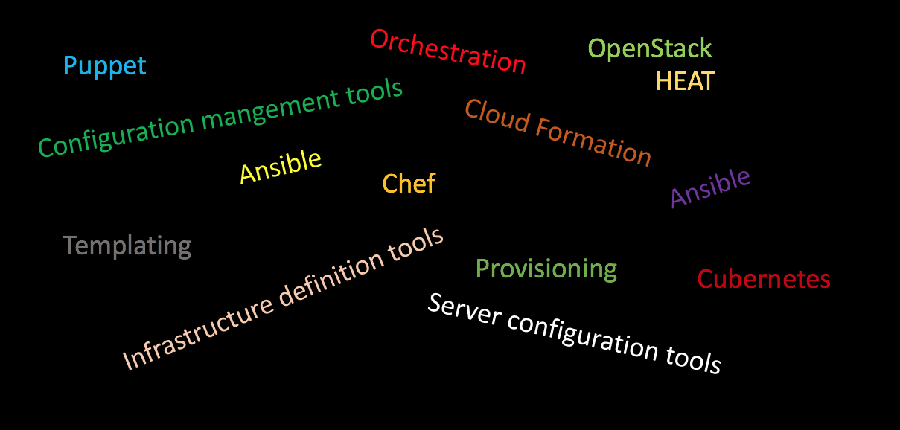
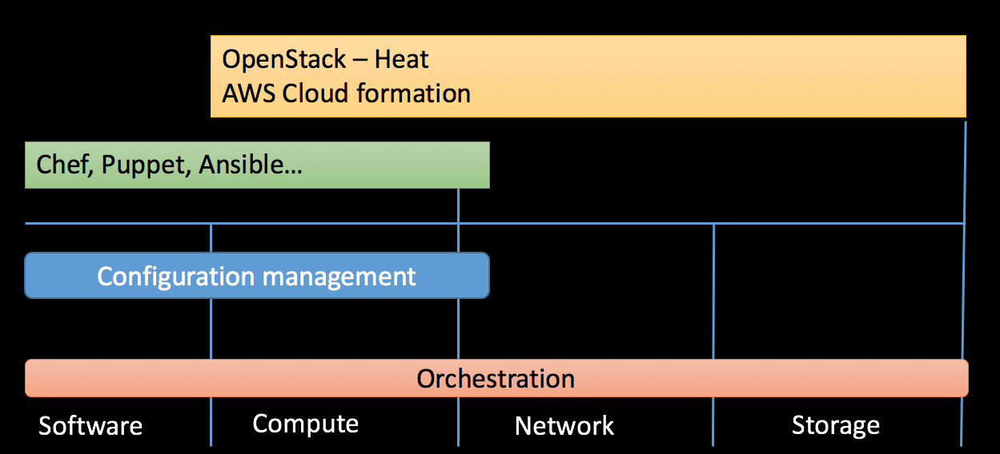

## Configuration management tools...

* or Server configuration management
* or Automation tools
* or Server orchestration tools


--



--
<div class="center">

</div>


---
## Some words

* Provisioning (by the books)
  * "making an infrastructure element"
  * Getting network device/servers ready to use (installed, configured and registered)
* Orchestration
  * Arranging or coordinating multiple systems
  * Provisioning many servers at once
  * Running same task on many servers at once
  * Setting up a Dynamic Infrastructure Platform
  * Automate tasks and orchestrate processes
* Configuration Management
  * Part of Provisioning
  * Configure your server repeatedly, consistently, transparent...


---



---
## Dynamic Infrastructure tools

* Public/Private IaaS, Community IaaS...
  * Cloud formation (AWS), Terraform, OpenStack (Heat)
  * On-demand
  * Create and destroy immediately (Minutes at the most!)
  * Self-Service
* Specifying what infrastructure resources should be allocated  
* Configuration files describe the components needed to run a single application or your entire datacenter.
* May create servers but is not responsible on whats on them (but could be)
* May pass configuration info to a server configuration tool (network addresses)

(Morris - chapter 2, Should be recap)


--
## Tools requirements

  - Programmable
    - GUI is nice but we want APIs (REST-APIs)
  - Scriptable & Powerful command-line tools
    * CLI that is easy to script
    * Take input from other tools (stdin, environment variables, command-line parameters)
    * Output should be able to be used by other tools
    * Like a Unix CLI
  - Support for unattended execution
    * No manual steps in the scripts, avoid Ad Hoc solutions
    * Triggable scripts, notifications
      * Testable, auto-scaling and recovery routines
  - Externalized configurations
    * Treated as software source code
    * Transparently, consistently, accurate test instances, version control


--

<div class="center">
Automate and script everything and you won´t fail!?
<br><br>

</div>


---
## Some (wider) automation principles
* Left-over principle
  * Automate everything you can - with reason
* Compensatory Principle
  * Fitt's list (1951) of attributes "decides" what to automate
* The Complementary Principle
  * More from human perspective. Analyze how people solve tasks and complement with automation
  * Give human the knowledge of tasks before automating it
* Automation bring stability to the system but can take away the skills maintaining the systems   
* All should be programmers?

Source: The practice of cloud system administration

<!-- {_style="text-align: right; font-size:70%"} -->


--
### When talking about automation scripts
  * Idempotent
   * The script should be able to execute many times without bad effects
  * Pre-checks, Post-checks
   * Testable
  * Visible failures
   * The team must get the notice
  * Parameterized
  * Big complex system, many script files, hard to manage  


--
## Back to the main story

<!-- {_class="center"} -->


<!-- {_class="center"} -->


---
## How to configure our servers...

  ...in a dynamic infrastructure

  * Manual Configuration and written documentation
    * Simple and works in very small situations
    * Documentation get easy stale
  * Some manual, many automation scripts
     - Hard to manage, share, configuration drift, ad-hoc
     - Writing script code that do stuff step-by-step
  * **Configure the state** rather then step-by-step
     - Out of state with notify the systems
     - Using modern configuration tools
     - Using Domain-specific languages (DSL) instead of script
     - Self-documention


--
## Server change management models

* Configuration synchronization
 * hourly schedules
 * push or pull changes
* **Immutable** Infrastructure
 * Completely replacing servers
 * Changes are made by building new servers
 * Minimal drift between environments
 * Containerized Infrastructure


--
## Server configuration tools
  * Create, provision and update servers - new generation tools
    * Ansible, Chef, Puppet, Salt(Stack)
  * Configuration enforcement
    * Desired state (not step-by-step), prevent configuration drift
  * Enables collaboration
    * One change, updates the whole infrastructure
    * Configuration repository (often enterprise products)
  * Version control friendly
  * Abstraction, high-level definitions


--
## Configuration Definition files

* Tool-specific files that drives server configuration tools
  * Own DSL (Domain specific languages), not script languages
    * Playbooks, manifest, templates, recipes...

```bash
sudo useradd -m EllenNu -p PASSWORD
sudo usermod -a -G students EllenNu
```

```yaml
user "EllenNu"
  state active
  gid   "students"
  home  "/home/ellennu"
  shell "/bin/csh"
```
* Declarative vs imperative
  * First do X, then do Y vs. should be Z
  * Clarity, easy to debug
  * Using predefined libraries (working over many platforms)
  * Easy to reuse over different environments - Use parameters


---
## Tools for configuring servers

* Ansible, CFEngine, Chef, Puppet, SaltStack
* Pull model
  * Central repository, agents on every node pulling configuration
* Push model
  * Central server pushing changes (through SSH keys)


<!-- {_class="center"} -->


--
## Puppet
* Created in 2005
* Open Source, built on top of Ruby
* Writing modules and manifests

```Ruby
node 'host2' {
  class { 'apache': }             # use apache module
  apache::vhost { 'example.com':  # define vhost resource
    port    => '80',
    docroot => '/var/www/html'
  }
}

```


--
## Chef
* Created in 2008
* Open source, mostly Ruby
* Written by developers from Puppet
* Writing cookbook and recipes

```Ruby
include_recipe "apache2"
include_recipe "mysql::client"
include_recipe "mysql::server"
include_recipe "php"
include_recipe "php::module_mysql"
include_recipe "apache2::mod_php5"

apache_site "default" do
  enable true
end

```


--
# Ansible
* Created in 2012
* SSH keys
* Playbooks, using YAML-configurations

```YAML
- hosts: webservers
  vars:
    http_port: 80
  remote_user: root
  tasks:
  - name: ensure apache is at the latest version
    yum: name=httpd state=latest
  - name: write the apache config file
    template: src=/srv/httpd.j2 dest=/etc/httpd.conf
    notify:
    - restart apache
  - name: ensure apache is running (and enable it at boot)
    service: name=httpd state=started enabled=yes
  handlers:
    - name: restart apache
      service: name=httpd state=restarted
```


---
## Written Report
* Investigate and compare these techniques
* No need to set up, try to present your findings with relevance to the literature and this lecture
* Explain it as if you were talking to your classmates
* A couple of pages per technique
* Think about one of these you want to use to set up a system in the project assignment


---
<br><br>
<div class="center">

</div>
